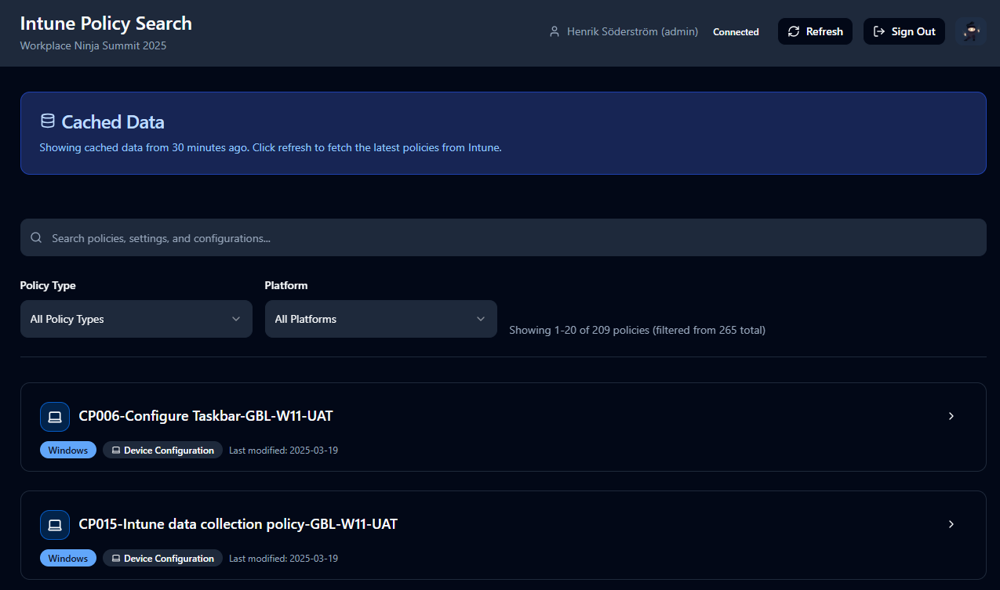

# 🥷 Intune Policy Search Dashboard

A interactive dashboard for searching and exploring Microsoft Intune configuration policies. Built with React and powered by Microsoft Graph API, this tool provides a streamlined interface for IT administrators to quickly find and analyze policy settings across their Intune tenant.



## ✨ Features

### 🔍 **Smart Search & Filtering**
- **Intelligent Search**: Auto-expands policies and filters settings based on your search terms
- **Real-time Filtering**: Search across policy names, descriptions, and individual settings
- **Highlighted Results**: Visual highlighting of matching terms for quick scanning
- **Auto-collapse**: Clean interface that collapses expanded policies when search is cleared

### 📊 **Comprehensive Policy Coverage**
- **Device Configuration Policies**: Windows, macOS, iOS, Android settings
- **Compliance Policies**: Device compliance rules and requirements  
- **App Protection Policies**: Mobile application management settings
- **Configuration Policies**: Settings Catalog and Administrative Templates
- **Security Baselines**: Microsoft security recommendations
- **Enrollment Configurations**: Device enrollment and setup policies

### 🎨 **Modern User Experience**
- **Responsive Design**: Works seamlessly on desktop, tablet, and mobile
- **Dark/Light Theme**: Toggle with a custom ninja animation 🥷
- **Live Data**: Real-time connection to your Intune tenant
- **Pagination**: Efficient handling of large policy datasets (200+ policies)
- **Professional UI**: Built with shadcn/ui components and Tailwind CSS

### 🚀 **Demo-Ready Features**
- **Certificate Filtering**: Hide certificate-related policies for public demos (`/demo` or `/filter` routes)
- **Clean Export**: Export policy data to JSON for analysis and troubleshooting
- **Fast Loading**: Client-side caching with 30-minute refresh intervals
- **Error Handling**: Graceful degradation for API failures

## 🛠️ Technology Stack

- **Frontend**: React 18+ with TypeScript
- **UI Framework**: shadcn/ui + Tailwind CSS
- **Authentication**: MSAL (Microsoft Authentication Library)
- **API**: Microsoft Graph API with beta endpoints
- **Build Tool**: Vite
- **Routing**: React Router for SPA navigation
- **State Management**: React Hooks with custom caching
- **Icons**: Lucide React

## 🚀 Quick Start

### Prerequisites

- Node.js 16+ and npm
- Microsoft Entra ID tenant with Intune licenses
- Entra ID app registration (see setup guide below)

### Installation

1. **Clone the repository**
   ```bash
   git clone https://github.com/yourusername/IntuneDashLove.git
   cd IntuneDashLove
   ```

2. **Install dependencies**
   ```bash
   npm install
   ```

3. **Configure Entra ID** (see [detailed setup guide](docs/Entra-Setup-Guide.md))
   - Create an Entra ID app registration
   - Configure API permissions
   - Grant admin consent

4. **Set up environment variables**
   ```bash
   cp env-example.txt .env
   ```
   
   Edit `.env` with your Entra ID details:
   ```env
   VITE_AZURE_CLIENT_ID=your-application-client-id
   VITE_AZURE_AUTHORITY=https://login.microsoftonline.com/your-tenant-id
   VITE_AZURE_REDIRECT_URI=http://localhost:8080
   VITE_AZURE_TENANT_ID=your-tenant-id
   ```

5. **Start the development server**
   ```bash
   npm run dev
   ```

6. **Open your browser** to `http://localhost:8080`

## 🔧 Configuration

### Entra ID Setup

Follow the comprehensive [Entra Setup Guide](docs/Entra-Setup-Guide.md) for detailed instructions on:
- Creating an Entra ID app registration
- Configuring required API permissions
- Setting up authentication
- Troubleshooting common issues

### Required Permissions

The application requires these Microsoft Graph delegated permissions:
- `DeviceManagementConfiguration.Read.All`
- `DeviceManagementApps.Read.All`
- `DeviceManagementManagedDevices.Read.All`
- `DeviceManagementServiceConfig.Read.All`
- `User.Read`

### User Requirements

Users must have one of these Entra ID roles:
- Global Administrator
- Intune Service Administrator
- Global Reader
- Security Reader
- Custom role with Intune read permissions

## 📖 Usage

### Basic Search
1. **Sign in** with your Entra ID credentials
2. **Wait for policies to load** (may take 30-60 seconds for large tenants)
3. **Use the search bar** to find specific policies or settings
4. **Click policy cards** to expand and view detailed settings

### Advanced Features
- **Demo Mode**: Navigate to `/demo` or `/filter` to hide certificate policies
- **Export Data**: Use the export feature for troubleshooting and analysis
- **Theme Toggle**: Click the ninja 🥷 to switch between light and dark themes
- **Pagination**: Navigate through large policy sets with the pagination controls

### Search Tips
- Search for setting names: `"app installer"`, `"bitlocker"`, `"password"`
- Search for values: `"enabled"`, `"disabled"`, `"required"`
- Search for policy types: `"compliance"`, `"configuration"`, `"baseline"`
- Policies auto-expand when they contain matching settings

## 🔒 Security & Privacy

- **Read-Only Access**: Application only reads policy data, never modifies
- **Client-Side Only**: No server-side storage or processing
- **Secure Authentication**: Uses Microsoft's MSAL library with OAuth 2.0 and Entra ID
- **Local Caching**: Data cached locally for 30 minutes to reduce API calls
- **No Sensitive Data**: Certificate details can be filtered out for demos

## 🏗️ Development

### Build for Production
```bash
npm run build
```

### Run Linting
```bash
npm run lint
```

### Project Structure
```
src/
├── components/          # React components
│   ├── ui/             # shadcn/ui base components
│   ├── Header.tsx      # Application header with auth
│   ├── PolicyCard.tsx  # Individual policy display
│   └── ...
├── hooks/              # Custom React hooks
├── lib/                # Utilities and helpers
├── pages/              # Page components
├── services/           # API and authentication services
└── types/              # TypeScript type definitions
```

## 🤝 Contributing

Contributions are welcome! Please feel free to submit a Pull Request. For major changes, please open an issue first to discuss what you would like to change.

1. Fork the repository
2. Create your feature branch (`git checkout -b feature/AmazingFeature`)
3. Commit your changes (`git commit -m 'Add some AmazingFeature'`)
4. Push to the branch (`git push origin feature/AmazingFeature`)
5. Open a Pull Request

## 📝 License

This project is licensed under the MIT License - see the [LICENSE](LICENSE) file for details.

## 🙏 Acknowledgments

- **Microsoft Graph API** for providing comprehensive Intune data access
- **shadcn/ui** for the beautiful component library
- **Tailwind CSS** for the utility-first CSS framework
- **MSAL.js** for seamless Entra ID authentication

## 📞 Support

If you encounter any issues or have questions:

1. Check the [Entra Setup Guide](docs/Entra-Setup-Guide.md) for configuration help
2. Review the troubleshooting section for common issues
3. Open an issue on GitHub with detailed information about your problem

---

**Made with ❤️ for the IT community. Happy policy hunting! 🥷**
