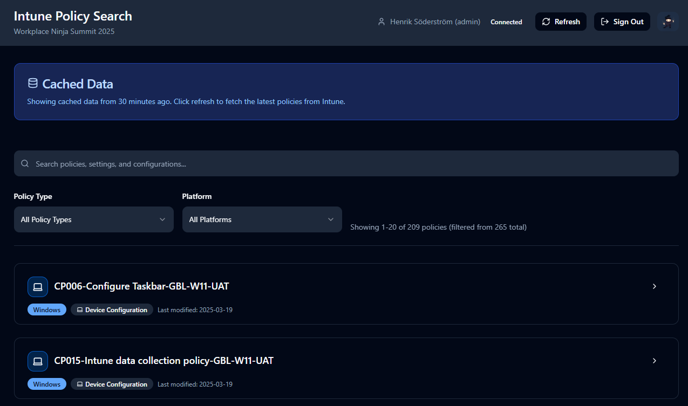

# Intune Policy Search

A fast, read-only console for exploring a Microsoft Intune tenant. What began as a policy search tool is now a multi-surface admin companion: search configuration policies down to the individual setting, browse a device and compliance dashboard, trace group assignments, and review the full audit history — all client-side, powered by the Microsoft Graph API and styled with **Microsoft Fluent 2**.



> Read-only by design. The app only ever *reads* from Graph — it never creates, modifies, or deletes anything in your tenant.

## ✨ What's inside

The app is organized into five surfaces, reachable from the top navigation once you sign in.

### 🔍 Policies (`/policies`)
- **Settings-level search** — fuzzy search (Fuse.js) across policy names, descriptions, and individual settings
- **Smart expand/collapse** — policies auto-expand to reveal matching settings and collapse when the search is cleared
- **Match highlighting** for quick scanning
- **Broad coverage** — Device Configuration, Compliance, Settings Catalog / Configuration, App Protection, Administrative Templates (Group Policy), Security Baselines, and Enrollment configurations
- **Demo mode** — visit `/demo` or `/filter` to hide certificate-related policies for screen-sharing

### 📊 Dashboard (`/dashboard`)
- **KPI tiles** and at-a-glance stats for managed devices and policies
- **Charts** (Recharts) — platform distribution donut and policy-type breakdown
- **Managed device table** with a detail drawer and deep device details
- **Recently modified** and **unassigned policies** tables
- **Assignment group list** for the tenant

### ✅ Compliance (`/dashboard/compliance`)
- A dedicated compliance view with pivots over device compliance state

### 📜 Audit (`/audit`)
- **Audit event timeline** with relative timestamps and resolved actor display names
- **Three pivots** — Timeline, By Resource, and By Actor
- **Detail drawer** with full metadata, actor info, and **property-level diffs** (old → new values)
- **Filtering** by date range (quick presets + custom), category, actor, and free text
- Built on `deviceManagement/auditEvents` with OData filters and pagination

### 👥 Groups (`/groups`)
- **Entra group lookup** → see which Intune policies are assigned to a group
- **Results table + detail drawer**, policy settings drill-down, and decoded PowerShell **script content**
- **Saved views** for recurring lookups

### 🎨 Cross-cutting
- **Microsoft Fluent 2 design** — light **and** dark themes, brand-blue accents, Segoe UI, Fluent elevation
- **Dark/light toggle** with a custom ninja spin animation 🥷
- **Client-side caching** (~30-minute refresh) to keep Graph calls down, with graceful error handling
- **Responsive** across desktop, tablet, and mobile
- **Desktop build** — ships as an Electron app for Windows (see [Desktop app](#-desktop-app))

## 🛠️ Technology stack

- **Framework**: React 18 + TypeScript, Vite 5
- **UI**: shadcn/ui (Radix primitives) + Tailwind CSS 3, Lucide icons, following [`DESIGN.md`](DESIGN.md) (Fluent 2)
- **Data/state**: TanStack Query, TanStack Table & Virtual, custom hooks with local caching
- **Search**: Fuse.js
- **Charts**: Recharts
- **Forms/validation**: React Hook Form + Zod
- **Auth**: MSAL (`@azure/msal-browser` / `@azure/msal-react`)
- **API**: Microsoft Graph (`@microsoft/microsoft-graph-client`), `v1.0` + `beta` endpoints
- **Desktop**: Electron + electron-builder
- **Testing**: Vitest + Testing Library

## 🚀 Quick start

### Prerequisites
- **Node.js 18+** (20 LTS recommended) and npm
- A **Microsoft Entra ID** tenant with Intune
- An **Entra ID app registration** (see the [Entra Setup Guide](docs/Entra-Setup-Guide.md))

### Installation

1. **Clone**
   ```bash
   git clone https://github.com/Henchibench/IntunePolicySearch.git
   cd IntunePolicySearch
   ```

2. **Install**
   ```bash
   npm install
   ```

3. **Configure Entra ID** — follow the [setup guide](docs/Entra-Setup-Guide.md) to create the app registration, add API permissions, and grant admin consent.

4. **Set environment variables**
   ```bash
   cp env-example.txt .env
   ```
   Edit `.env`:
   ```env
   VITE_AZURE_CLIENT_ID=your-application-client-id
   VITE_AZURE_AUTHORITY=https://login.microsoftonline.com/your-tenant-id
   VITE_AZURE_REDIRECT_URI=http://localhost:8080
   # Optional, single-tenant setups:
   VITE_AZURE_TENANT_ID=your-tenant-id
   ```

5. **Run**
   ```bash
   npm run dev
   ```

6. Open **http://localhost:8080** and sign in.

### npm scripts
| Script | Purpose |
|--------|---------|
| `npm run dev` | Start the Vite dev server (port 8080) |
| `npm run build` | Production build |
| `npm run build:dev` | Development-mode build |
| `npm run preview` | Preview a production build |
| `npm run lint` | Run ESLint |
| `npm test` | Run the Vitest suite once |
| `npm run test:watch` | Vitest in watch mode |

## 🖥️ Desktop app

The `electron-app/` directory packages the web app as a Windows desktop app. Entra config is supplied at runtime via a first-run setup screen (no `.env` baked into the binary).

```bash
cd electron-app
npm install
npm start            # build + launch locally
npm run dist:win     # produce NSIS installer + portable .exe (release/)
```

## 🔧 Configuration

### Required Graph permissions
Delegated Microsoft Graph permissions (configured on the app registration):
- `DeviceManagementConfiguration.Read.All`
- `DeviceManagementApps.Read.All`
- `DeviceManagementManagedDevices.Read.All`
- `DeviceManagementServiceConfig.Read.All`
- `Group.Read.All` — resolve assignment group names
- `User.Read.All` — resolve user assignment / actor names

### User roles
Signed-in users need read access to Intune — e.g. Global Reader, Intune Administrator, Security Reader, Global Administrator, or a custom role with Intune read permissions.

See the [Entra Setup Guide](docs/Entra-Setup-Guide.md) for step-by-step instructions and troubleshooting.

## 📖 Usage tips

- **Search settings, not just names**: `bitlocker`, `password`, `app installer`; or values like `enabled`, `required`
- **Audit**: start with the Timeline, then pivot **By Resource** or **By Actor**; click any event for the full property diff
- **Groups**: paste or search a group, then open a result to see assigned policies and decoded script content
- **Demo mode**: `/demo` or `/filter` hides certificate policies for safe screen-sharing
- **Theme**: click the ninja 🥷 to switch light/dark

## 🎨 Design system

The UI follows **Microsoft Fluent 2 for the Web**, fully specified in [`DESIGN.md`](DESIGN.md) — neutral tinted canvas, Communication-blue brand accent (`#0F6CBD`), Segoe UI type ramp, 4px control / 8px container radii, and Fluent two-part elevation, in both light and dark themes. All styling changes should follow that document (enforced via [`CLAUDE.md`](CLAUDE.md)).

## 🔒 Security & privacy

- **Read-only** — no write operations against the tenant
- **Client-side only** — no backend; tokens live in `sessionStorage`, data is cached locally (~30 min)
- **Standard auth** — Microsoft MSAL with OAuth 2.0 / Entra ID
- **Demo-safe** — certificate details can be filtered out for public demos

## 🏗️ Development

### Testing
The project uses Vitest + Testing Library (run `npm test`). The current suite covers hooks and components across the app.

### Project structure
```
src/
├── components/
│   ├── ui/            # shadcn/ui base components (Fluent 2-styled)
│   ├── audit/         # Audit timeline, pivots, detail drawer, diffs
│   ├── dashboard/     # KPI tiles, device table/drawer, charts, tables
│   ├── group/         # Group lookup results, drawers, settings drill-down
│   ├── landing/       # Landing surface pieces
│   ├── PillNav.tsx    # Top Fluent tab navigation
│   └── ...
├── hooks/             # Data + auth hooks (useAuditEvents, usePolicySearch, ...)
├── lib/               # Utilities (settings extraction, pivots, mock data)
├── pages/             # Index, Policies, Dashboard, DashboardCompliance, GroupLookup, Audit, NotFound
├── services/          # MSAL auth config + Graph/cache services
└── types/             # TypeScript definitions
electron-app/          # Electron desktop wrapper
docs/                  # Entra setup guide, design specs & plans
```

## 🤝 Contributing

Contributions are welcome. For significant changes, open an issue first to discuss the direction.

1. Fork the repo
2. Create a feature branch (`git checkout -b feature/your-feature`)
3. Commit your changes
4. Push and open a Pull Request

Please keep UI changes consistent with [`DESIGN.md`](DESIGN.md), and run `npm run lint` and `npm test` before submitting.

## 📝 License

Licensed under the MIT License — see [LICENSE](LICENSE) for details.

## 🙏 Acknowledgments

- **Microsoft Graph API** — Intune data access
- **Microsoft Fluent 2** — the design language
- **shadcn/ui** & **Radix** — component primitives
- **Tailwind CSS** — styling
- **MSAL.js** — Entra ID authentication

## 📞 Support

1. Check the [Entra Setup Guide](docs/Entra-Setup-Guide.md) for configuration help
2. Open a GitHub issue with details about your problem

---

**Made with ❤️ for the IT community. Happy policy hunting! 🥷**
